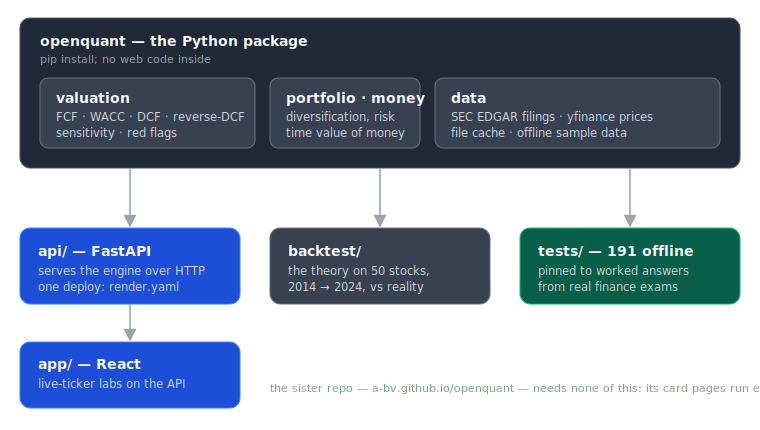

# openquant-engine

[](https://github.com/A-bv/openquant-engine/actions/workflows/ci.yml)
[](pyproject.toml)
[](LICENSE)

A corporate-finance engine you can actually trust: every formula is **pinned to
the worked answer of a real finance exam**, and the whole theory was
**backtested against ten years of real returns** — including the part where it
turned out not to predict anything.

```python
from openquant.valuation.wacc import capm_cost_of_equity

capm_cost_of_equity(risk_free_rate=0.08, beta=1.50, market_risk_premium=0.08)
# 0.20 — the exact answer of EPFL Sample Exam 1, Problem 2.
# A test guards this. If the formula drifts, the suite fails.
```

## Use it from the web — live, no install

| Piece | Where |
|---|---|
| **The live labs** | [a-bv.github.io/openquant-engine](https://a-bv.github.io/openquant-engine/) — the React app, deployed from `app/` |
| **The API behind them** | [a-bv-openquant-api.hf.space](https://a-bv-openquant-api.hf.space/docs) — running free on Hugging Face Spaces (built from `deploy/hf/`) |

Type any US ticker and the labs value it live from its SEC filings and market
price. The free Space idles after long inactivity, so the first request after a
quiet spell takes a few seconds to wake it. A `render.yaml` is also included for
anyone who prefers to run the API on Render instead.

## Why this engine is different

Most finance libraries ask you to trust them. This one shows its receipts:

1. **Exam-pinned correctness.** The ~190-test offline suite checks the engine
   against hand-worked answers from two university finance exams
   ([`tests/test_epfl_exam1.py`](tests/test_epfl_exam1.py),
   [`tests/test_epfl_exam2.py`](tests/test_epfl_exam2.py)) — DCF, WACC, CAPM,
   beta un/relevering, NPV-vs-IRR traps, portfolio variance, Sharpe. It runs in
   about one second, fully offline.
2. **An honest backtest.** [`backtest/`](backtest/) runs the valuation theory
   on 50 large US stocks as of January 2014 and compares it with what actually
   happened by 2024. Result: the stocks it called *cheap* beat the market less
   than half the time. The engine's job is to expose the bet inside a price —
   not to predict the future — and the backtest is the proof we mean it.
3. **Loud failures.** No silent wrong answers: impossible inputs raise
   (`IRR` with no real root, growing annuity at `rate == growth`, YTM for an
   unreachable price).

## Quickstart

```bash
pip install "openquant-engine[api] @ git+https://github.com/A-bv/openquant-engine"
```

```python
from openquant.data import sample_financials       # offline sample, EDGAR-shaped
from openquant.valuation.fcf import FCFAnalyser

analysis = FCFAnalyser().analyse(sample_financials())
analysis.latest_fcf                                 # 39.0 — no network needed
```

Real data is one call away (SEC EDGAR for filings, yfinance for prices,
transparently cached):

```python
from openquant.data import get_fundamentals, get_prices, validate_ticker

validate_ticker("AAPL").badge      # "green" — tradable history + filings exist
statements = get_fundamentals("AAPL")   # standardized 10-K series
prices = get_prices("AAPL")             # daily closes + market index
```

## What is inside



| Piece | What it does |
|---|---|
| `openquant/valuation` | FCF analysis, WACC, DCF, **reverse-DCF** (what growth does today's price imply?), sensitivity, red flags |
| `openquant/portfolio` | diversification measured honestly: effective number of independent bets, risk contributions, minimum-variance mix |
| `openquant/money` | time-value-of-money decisions (lump sum now vs. payments over time) |
| `openquant/data` | one module per source — SEC EDGAR (filings), yfinance (prices) — plus a file cache and offline fixtures |
| `api/` | a thin FastAPI layer serving the engine over HTTP (`render.yaml` deploys it in one click) |
| `app/` | a React app for the live-ticker labs, driven entirely by the API |
| `backtest/` | the 2014→2024 study, with its results committed |

The import package is `openquant`; the API and app are deliberately *not* part
of it — the engine stays pure Python with five dependencies.

## Run it

```bash
make install    # engine (editable) + app dependencies
make test       # ~190 offline tests, ~1s
make dev        # API on :8000 and React app on :5173 together
```

## Design rules

- **Never claim the impossible.** The engine computes what assumptions a price
  implies; it never outputs "this stock is worth $X".
- **Fail loud.** A formula outside its domain raises; it never returns a
  plausible-looking wrong number.
- **Offline first.** Everything except live fetches runs with zero network:
  the sample fixtures mirror the exact shape EDGAR returns.
- **Pinned everything.** Dependency versions, exam answers, and (in the sister
  repo) a JS↔Python parity suite — nothing drifts silently.

## The sister repo

The public product built on these ideas — the interactive finance course as
53 cards, decision journeys, and the "did the theory hold?" page — lives at
[**A-bv/openquant**](https://github.com/A-bv/openquant) and runs entirely in
the browser: [a-bv.github.io/openquant](https://a-bv.github.io/openquant/).
This engine was extracted from it in July 2026 so that each repo tells one
story.

MIT licensed. The finance follows Berk & DeMarzo, *Corporate Finance*.
